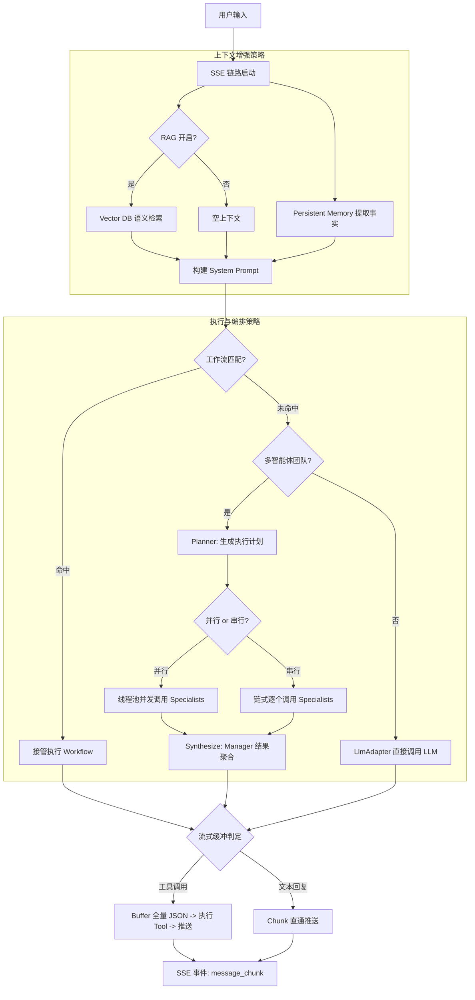

# zlAI-v2 Stream (SSE) 技术架构与调用策略详述

## 1. 概述
zlAI-v2 的流式输出不仅是数据的传输，更是 **RAG 检索增强**、**长期记忆对齐**、**多智能体编排 (Multi-Agent)** 与 **工作流调度** 的深度融合。后端基于 **Spring WebFlux** 响应式流，确保了在高并发下的吞吐能力与实时性。

---

## 2. RAG 与上下文增强策略

系统采用“双轨并行”的上下文增强方案，在 LLM 请求发起前构建最完整的知识背景：

### 2.1 向量上下文 (Vector Context)
- **触发逻辑**: 根据用户消息的语义特征，从绑定的知识库中执行向量检索。
- **动态 Query**: 系统支持对原始用户输入进行语义提取，生成更适合检索的候选 Query。
- **Top-K 控制**: 通过 `ragTopK` 参数动态调节检索深度，确保上下文既丰富又不超出 Token 限制。

### 2.2 长期记忆 (Persistent Memory)
- **核心机制**: 通过 `AgentMemoryService` 维护用户与 Agent 之间的长期交互事实。
- **注入策略**: 检索到的记忆片段被包裹在 `<memory_context>` 标签中，作为“背景事实”而非“即时指令”注入 System Prompt，有效解决 AI 的“健忘”问题。

---

## 3. Multi-Agent 编排与协作策略

当开启“团队模式”时，系统采用 **Planner-Manager** 架构进行复杂任务的解构与分发。

### 3.1 任务规划 (Planning)
- **Planner 决策**: `MultiAgentPlanner` 分析用户意图，生成 `MultiAgentPlan`。
- **执行模式**:
    - **并行 (Parallel)**: 任务可独立拆分（如：搜集信息+数据分析），多个 Specialist Agent 异步执行。
    - **串行 (Sequential)**: 任务存在依赖链（如：写作+翻译+润色），Agent 顺序流转。

### 3.2 专家执行 (Specialist Execution)
- **隔离性**: 每个 Agent 在独立的 `agentExecutor` 线程池中运行。
- **超时保护**: 强制执行 `agentTimeoutSeconds` 阈值，防止单一 Agent 响应过慢导致整体超时。
- **工具绑定**: 不同的 Agent 可绑定专属的 Skill，实现“专人专事”。

### 3.3 结果合成 (Synthesize)
- **Manager 对齐**: 所有 Specialist 的输出并不会直接发给用户，而是先流向 Manager Agent。
- **合成逻辑**: Manager 根据原始意图和各专家的输出进行“事实校对”与“语言对齐”，生成最终回复。

---

## 4. 深度调用流程图

---

## 5. 可靠性与性能保障

### 5.1 异步非阻塞传输
- **背压处理 (Backpressure)**: 利用 Project Reactor 的 `.onBackpressureBuffer()`，在网络波动时通过 `DROP_LATEST` 策略保护内存不溢出。
- **超时降级**: 配置 `.timeout()` 机制。若外部 LLM 在 20s 内无首包返回，自动触发中断并返回错误事件。

### 5.2 状态追踪
- **Progress Recording**: 在 Agent 编排的每个阶段（Planned -> Executed -> Synthesized）均会向数据库写入 `progress` 记录。
- **中断响应**: 前端 `AbortController` 信号会透传至后端 `FluxSink` 的 `onCancel` 钩子，立即切断外部 HTTP 连接，最大化节省 API 成本。

---

## 6. SSE 事件协议 (V2)

| 事件 | Payload 结构 | 描述 |
| :--- | :--- | :--- |
| `session_created` | `{"chatId": "string"}` | 新会话 ID 下发 |
| `message_chunk` | `{"role": "assistant", "content": "string"}` | 增量内容片段 |
| `progress` | `{"step": "string", "details": {...}}` | 记录 Agent 编排的进度状态 |
| `done` | `{"success": true}` | 正常结束标志 |
| `error` | `{"error": "string"}` | 异常信息 |
